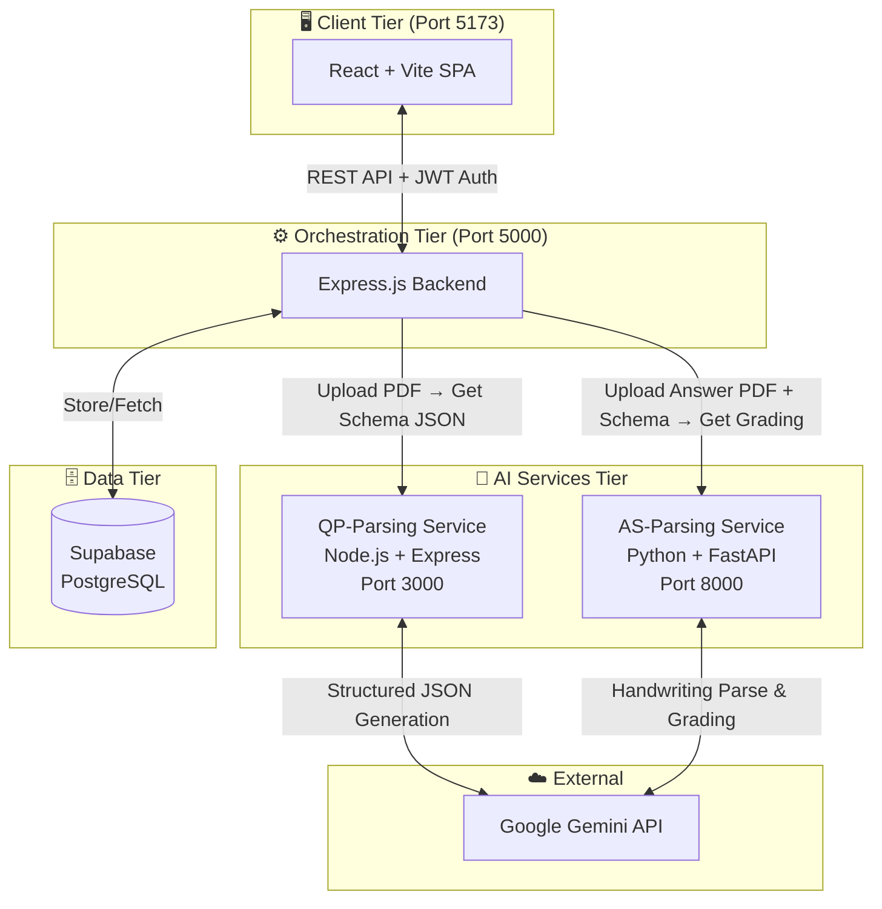
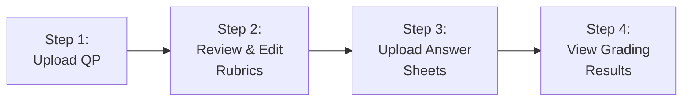
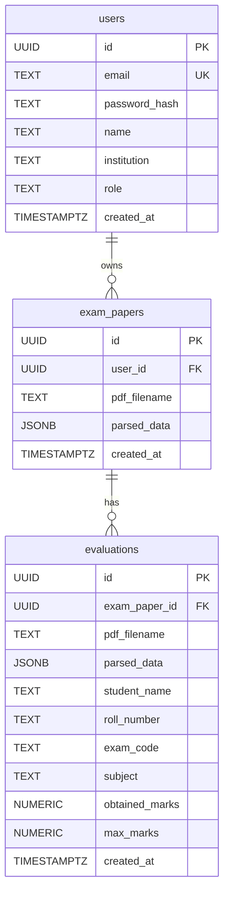
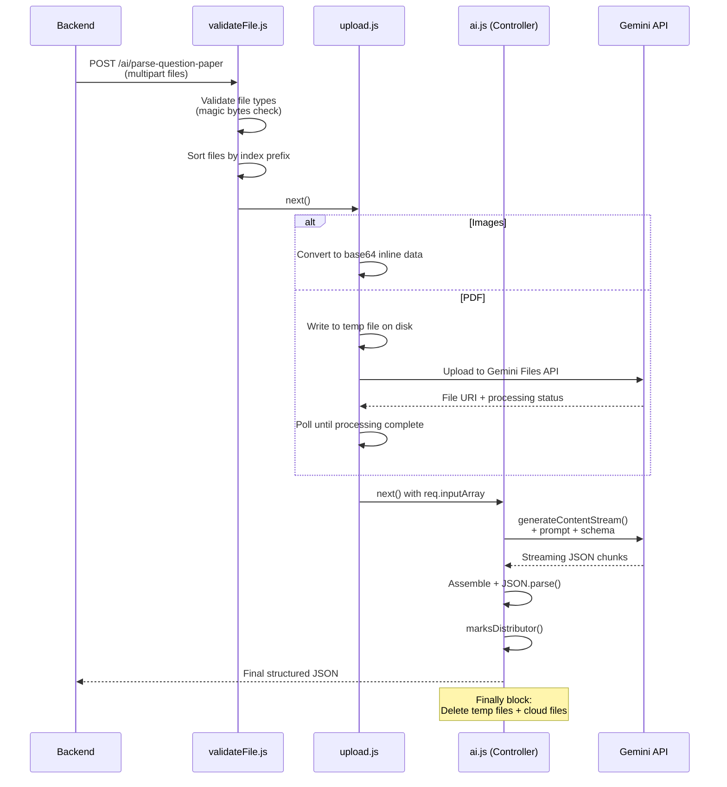
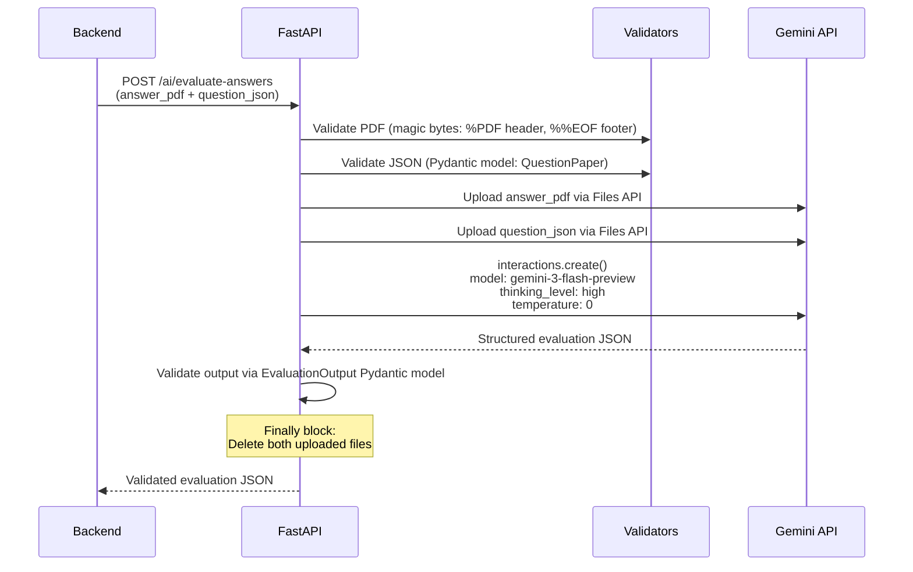
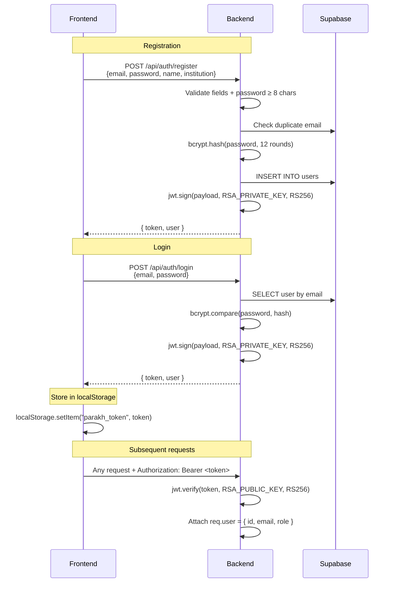
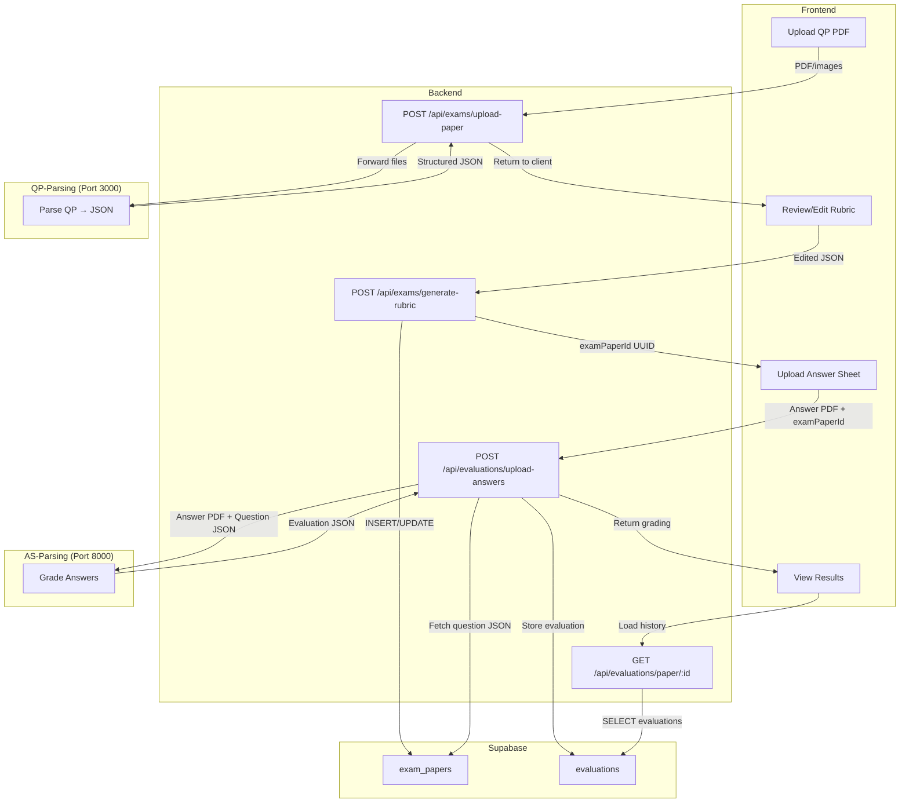

# Parakh — Complete Project Deep-Dive

> **Parakh** (Hindi: "परख", meaning *assessment* or *evaluation*) is an AI-powered answer sheet evaluation portal that automates the entire grading pipeline: from parsing question papers into structured schemas, to evaluating handwritten student answer sheets using Google's Gemini generative AI.

Developed during the AICTE IDEA Lab Summer Internship at USICT GGSIPU under Dr. Raj Kumar.

---

## Table of Contents

1. [High-Level Architecture](#1-high-level-architecture)
2. [The Complete User Journey](#2-the-complete-user-journey)
3. [Technology Stack](#3-technology-stack)
4. [Database Design (Supabase)](#4-database-design-supabase)
5. [Backend — The Orchestrator](#5-backend--the-orchestrator)
6. [AI Service: QP-Parsing (Question Paper)](#6-ai-service-qp-parsing-question-paper)
7. [AI Service: AS-Parsing (Answer Sheet)](#7-ai-service-as-parsing-answer-sheet)
8. [Frontend — React SPA](#8-frontend--react-spa)
9. [Authentication System](#9-authentication-system)
10. [Cross-Service Data Flow](#10-cross-service-data-flow)
11. [Key Design Decisions & Patterns](#11-key-design-decisions--patterns)

---

## 1. High-Level Architecture

Parakh follows a **four-tier microservices architecture**:



| Tier | Service | Language | Port | Responsibility |
|------|---------|----------|------|---------------|
| Client | [frontend/](file:///c:/Coding/Projects/Parakh/Parakh/frontend) | React 19 + Vite 8 | 5173 | UI, routing, state management, file upload |
| Orchestration | [backend/](file:///c:/Coding/Projects/Parakh/Parakh/backend) | Node.js + Express 5 | 5000 | Auth, DB ops, proxying to AI services |
| AI — QP | [ai-service/QP-parsing/](file:///c:/Coding/Projects/Parakh/Parakh/ai-service/QP-parsing) | Node.js + Express | 3000 | Question paper → Structured JSON |
| AI — AS | [ai-service/AS-parsing/](file:///c:/Coding/Projects/Parakh/Parakh/ai-service/AS-parsing) | Python + FastAPI | 8000 | Answer sheet evaluation & grading |
| Data | Supabase | PostgreSQL | Cloud | Users, exam papers, evaluations |

---

## 2. The Complete User Journey

The portal guides teachers through a **4-step assessment pipeline**:



### Step 1 — Upload Question Paper
- Teacher uploads a PDF (or multiple images) of a question paper
- Backend forwards the file to the **QP-Parsing AI service** (Port 3000)
- Gemini AI parses the document using a detailed 86-line prompt and a formal JSON schema
- The structured question paper JSON is returned, containing:
  - Paper metadata (title, subject, total marks, duration, instructions)
  - Sections with section-level choices
  - Hierarchical questions (up to 3 levels deep: Q1 → Q1.a → Q1.a.i)
  - Question types: MCQ, MTF (Match the Following), Theory, Hybrid
  - Bilingual text support (English + Hindi)
  - AI-generated rubric placeholders, attachment descriptions, diagram flags

### Step 2 — Review & Edit Rubrics
- The parsed JSON is displayed in a tree-structured UI (via [QuestionNode](file:///c:/Coding/Projects/Parakh/Parakh/frontend/src/components/QuestionNode.jsx))
- Teachers can edit rubric criteria, marks, question text
- The finalized rubric is saved to Supabase via `POST /api/exams/generate-rubric`
- Returns a UUID (`examPaperId`) that links all future evaluations

### Step 3 — Upload Answer Sheets
- Teacher uploads student answer sheet PDFs (one at a time, or batch)
- Each file is sent to the **AS-Parsing AI service** (Port 8000) along with the question paper JSON
- Gemini AI reads the handwritten answers, maps them to the question hierarchy, and evaluates them against rubrics
- Returns a structured evaluation JSON with marks, satisfies/missing criteria, confidence scores

### Step 4 — View Results
- Detailed per-question breakdown of marks earned
- Student metadata extraction (name, roll number, exam code)
- Attempt summary (which questions were attempted, which were invalid)
- Score visualization and color-coded pass/fail indicators

---

## 3. Technology Stack

### Frontend
| Package | Purpose |
|---------|---------|
| `react` 19.2.7 | Core UI library |
| `react-dom` 19.2.7 | DOM rendering |
| `react-router-dom` 7.18.1 | Client-side routing |
| `lucide-react` 1.24.0 | Icon library |
| `jspdf` 4.2.1 | PDF generation (client-side reports) |
| `vite` 8.1.1 | Build tool / dev server |

### Backend (Orchestrator)
| Package | Purpose |
|---------|---------|
| `express` 5.2.1 | HTTP framework |
| `@supabase/supabase-js` 2.110.1 | Supabase client SDK |
| `axios` 1.18.1 | HTTP client for AI service calls |
| `bcryptjs` 3.0.3 | Password hashing (12 salt rounds) |
| `jsonwebtoken` 9.0.3 | JWT token sign/verify |
| `multer` 2.2.0 | Multipart file upload (in-memory) |
| `file-type` 22.0.1 | Binary file type detection |
| `morgan` 1.11.0 | HTTP request logging |
| `cors` 2.8.6 | CORS middleware |

### QP-Parsing AI Service
| Package | Purpose |
|---------|---------|
| `@google/genai` 2.10.0 | Google Gemini AI SDK |
| `express` 5.2.1 | HTTP framework |
| `multer` 2.2.0 | File upload middleware |
| `file-type` 22.0.1 | File validation |

### AS-Parsing AI Service
| Package | Purpose |
|---------|---------|
| `fastapi` 0.139.0 | Python async HTTP framework |
| `google-genai` 2.10.0 | Google Gemini AI SDK |
| `python-multipart` 0.0.32 | Form file handling |
| `pydantic` (via FastAPI) | Response schema validation |

---

## 4. Database Design (Supabase)

Source: [schema.sql](file:///c:/Coding/Projects/Parakh/Parakh/doc/Architectural%20docs/schema.sql)

Three tables connected via foreign keys with `ON DELETE CASCADE`:



> [!IMPORTANT]
> Both `parsed_data` columns store raw JSON blobs — the question paper schema in `exam_papers` and the full evaluation output in `evaluations`. This means the entire AI response is preserved verbatim as JSONB.

**Key relationships:**
- Deleting a **user** cascades to delete all their **exam papers** and **evaluations**
- Deleting an **exam paper** cascades to delete all its **evaluations**
- Row Level Security (RLS) is enabled on all tables

---

## 5. Backend — The Orchestrator

The backend ([app.js](file:///c:/Coding/Projects/Parakh/Parakh/backend/app.js)) is a pure orchestrator — it holds **no AI logic** itself. It manages authentication, validates requests, brokers data between the frontend, database, and AI services.

### Route Structure

| Endpoint | Method | Auth | Handler | Purpose |
|----------|--------|------|---------|---------|
| `/api/auth/register` | POST | ✗ | [authController.register](file:///c:/Coding/Projects/Parakh/Parakh/backend/controllers/authController.js#L32) | Create teacher account |
| `/api/auth/login` | POST | ✗ | [authController.login](file:///c:/Coding/Projects/Parakh/Parakh/backend/controllers/authController.js#L132) | Sign in, get JWT |
| `/api/exams/upload-paper` | POST | ✓ | [examController.uploadPaper](file:///c:/Coding/Projects/Parakh/Parakh/backend/controllers/examController.js#L10) | Upload QP → AI parse |
| `/api/exams/generate-rubric` | POST | ✓ | [examController.generateRubric](file:///c:/Coding/Projects/Parakh/Parakh/backend/controllers/examController.js#L55) | Save rubric to DB |
| `/api/exams/list` | GET | ✓ | [examController.listPapers](file:///c:/Coding/Projects/Parakh/Parakh/backend/controllers/examController.js#L101) | Get all user's papers |
| `/api/exams/:id` | DELETE | ✓ | [examController.deletePaper](file:///c:/Coding/Projects/Parakh/Parakh/backend/controllers/examController.js#L122) | Delete paper + cascade |
| `/api/evaluations/upload-answers` | POST | ✓ | [evaluationController.uploadAnswers](file:///c:/Coding/Projects/Parakh/Parakh/backend/controllers/evaluationController.js#L14) | Upload answer → AI grade |
| `/api/evaluations/paper/:examPaperId` | GET | ✓ | [evaluationController.getEvaluations](file:///c:/Coding/Projects/Parakh/Parakh/backend/controllers/evaluationController.js#L134) | Get all evals for a paper |
| `/api/evaluations/:id` | DELETE | ✓ | [evaluationController.deleteEvaluation](file:///c:/Coding/Projects/Parakh/Parakh/backend/controllers/evaluationController.js#L189) | Delete single evaluation |
| `/health` | GET | ✗ | inline | Health check |

### Service Layer Architecture

The backend follows a clean **Controller → Service** separation:

```
Routes → Middleware (auth + file validation) → Controllers → Services → {DB / AI proxy}
```

- **[aiService.js](file:///c:/Coding/Projects/Parakh/Parakh/backend/services/aiService.js)** — Proxies files to the two AI microservices via `axios` + `FormData`. Two functions:
  - `parseQuestionPaper(files)` → calls `QP-parsing` at port 3000
  - `evaluateAnswers(buffer, name, mime, questionJson)` → calls `AS-parsing` at port 8000
  - Both use a 10-minute timeout (`600000ms`) for AI processing

- **[examService.js](file:///c:/Coding/Projects/Parakh/Parakh/backend/services/examService.js)** — CRUD for `exam_papers` table. Stores parsed JSON exactly as-is from AI (no transformation).

- **[evaluationService.js](file:///c:/Coding/Projects/Parakh/Parakh/backend/services/evaluationService.js)** — Handles `evaluations` table. Key logic:
  - Computes `obtained_marks` by summing `earnedMarks.value` across all `answerBlocks`
  - Fetches `max_marks` from the parent `exam_papers.parsed_data.paperMetadata.totalMarks`
  - Extracts student metadata (name, roll number, exam code, subject) from the AI response
  - Ownership verification: checks that the parent exam paper's `user_id` matches the requester

### Middleware Pipeline

1. **[authMiddleware.js](file:///c:/Coding/Projects/Parakh/Parakh/backend/middleware/authMiddleware.js)** — Verifies RS256 JWT from `Authorization: Bearer <token>` header. Attaches `req.user = { id, email, role }`.

2. **[validateFile.js](file:///c:/Coding/Projects/Parakh/Parakh/backend/middleware/validateFile.js)** — Uses `file-type` library to inspect file magic bytes (not just MIME headers). Rules:
   - First file is image → all files must be images
   - First file is PDF → only 1 file allowed (no mixing)
   - Files are sorted by filename prefix (e.g., `0_page.jpg`, `1_page.jpg`) for correct page ordering

3. **[errorHandler.js](file:///c:/Coding/Projects/Parakh/Parakh/backend/middleware/errorHandler.js)** — Global catch-all that returns `{ success: false, error: message }`. Includes stack traces in development.

---

## 6. AI Service: QP-Parsing (Question Paper)

**Entry point:** [src/index.js](file:///c:/Coding/Projects/Parakh/Parakh/ai-service/QP-parsing/src/index.js)
**Single endpoint:** `POST /ai/parse-question-paper`

This is the most prompt-engineering-intensive part of the project. It converts an unstructured exam PDF/images into a deeply structured JSON schema.

### Request Pipeline



### The Prompt Engineering ([seventh.txt](file:///c:/Coding/Projects/Parakh/Parakh/ai-service/QP-parsing/prompts/seventh.txt))

This is the 7th iteration of the prompt (hence `seventh.txt`). It's an 86-line, meticulously crafted instruction set with 12 strict structural rules:

**Key rules the prompt enforces:**
1. **Marks hierarchy**: Leaf nodes get actual marks; parent nodes must say `"infer from children and choice description"`
2. **No fabrication**: Never invent sub-questions from bullet counts (e.g., "List 4 items" does NOT become 4 child nodes)
3. **Bilingual support**: All text stored as `{ en: "...", hi: "..." }`
4. **Visual extraction**: Diagrams must be described with complete data (coordinates, labels, values) — not just "see diagram"
5. **Choice modeling**: OR/optional questions are modeled at three levels:
   - `globalChoices` — between sections
   - `sectionChoices` — between top-level questions within a section
   - `choiceInformation` — between sub-questions within a question
6. **Diagram detection**: `diagramRequired: true` only if the question asks the student to *draw* something
7. **Rubric**: Always returns empty arrays (the teacher fills these in during Step 2)

### The JSON Schema ([newSchema.js](file:///c:/Coding/Projects/Parakh/Parakh/ai-service/QP-parsing/schemas/newSchema.js))

Uses `@google/genai`'s `Type` system to define a strict response schema enforced at the Gemini API level. The schema is deeply nested:

```
Root
├── paperMetadata (title, subject, examType, duration, totalMarks, instructions)
├── parsingStatus (success, paperClarity, confidence, errors, warnings)
├── sections[] ─── sectionId, sectionChoices[], sectionInstructions
│   └── questions[] ─── Level 1 (id, type, text, marks, extractedTotalMarks, rubric, options, matchData, attachments, choiceInfo, diagramRequired)
│       └── children[] ─── Level 2
│           └── children[] ─── Level 3 (deepest, no further nesting)
└── globalChoices[]
```

### The Marks Distributor ([marksDistributor.js](file:///c:/Coding/Projects/Parakh/Parakh/ai-service/QP-parsing/utils/marksDistributor.js))

A post-processing utility that runs after Gemini's response. It handles a common edge case: when a parent question says "20 marks" but the AI couldn't determine individual sub-part marks.

**Logic:**
1. For each parent question with children, collect all leaf nodes
2. **Case 1 — Inconsistent** (some have marks, some empty): Return `false` → 422 error
3. **Case 2 — All empty**: Divide `extractedTotalMarks` equally among leaves
4. **Case 3 — All filled**: Leave as-is

### Retry & Fallback Strategy ([ai.js](file:///c:/Coding/Projects/Parakh/Parakh/ai-service/QP-parsing/controllers/ai.js))

- Primary model: `gemini-2.5-flash`
- Up to 5 retry attempts with exponential backoff
- After 3 failures, falls back to the fallback model (currently same model)
- Retries on 503 (server busy) and 429 (rate limit)
- Temperature: `0.1` (near-deterministic output)
- Uses **streaming** (`generateContentStream`) to handle large papers
- Validates response starts with `{` before attempting JSON parse

### Cleanup
The `finally` block in the controller **always** runs:
- Deletes temporary files from local disk
- Deletes uploaded files from Gemini's cloud storage

---

## 7. AI Service: AS-Parsing (Answer Sheet)

**Entry point:** [app.py](file:///c:/Coding/Projects/Parakh/Parakh/ai-service/AS-parsing/app.py)
**Single endpoint:** `POST /ai/evaluate-answers`
**Framework:** FastAPI (Python)

This service grades handwritten student answer sheets against the structured question paper JSON.

### Request Flow



### Input Validation

1. **[validate_pdf.py](file:///c:/Coding/Projects/Parakh/Parakh/ai-service/AS-parsing/helpers/validate_pdf.py)** — Checks binary signatures: first 4 bytes must be `%PDF`, last 1024 bytes must contain `%%EOF`

2. **[validate_json.py](file:///c:/Coding/Projects/Parakh/Parakh/ai-service/AS-parsing/helpers/validate_json.py)** — Validates the incoming question paper JSON against the [QuestionPaper](file:///c:/Coding/Projects/Parakh/Parakh/ai-service/AS-parsing/pydantic_models/questions_schema_model.py) Pydantic model (strict mode: `extra="forbid"`)

### The Evaluation Prompt ([prompt.py](file:///c:/Coding/Projects/Parakh/Parakh/ai-service/AS-parsing/helpers/prompt.py))

A 90-line prompt that instructs Gemini to:

1. **Extract** — Read only what the student wrote, interpreting handwriting semantically
2. **Evaluate** — Score against rubrics if they exist, or use academic standards if they don't
3. **Map** — Place every answer into the exact hierarchy from `questionStructure`
4. **Handle choices** — Detect and flag invalid attempts at mutually exclusive questions
5. **Summarize** — Produce `answerSummary`, `satisfies`, `missing` for each answer block

**Key execution pipeline** (5 internal passes):
1. Identify answer regions, boundaries, visual components
2. Verify hierarchy, page-break continuity, resolve ambiguities
3. Apply rubric scoring or fallback academic evaluation
4. Construct the hierarchical tree matching `questionStructure`
5. Validate data consistency

### The Evaluation Response Model ([evaluation_response_model.py](file:///c:/Coding/Projects/Parakh/Parakh/ai-service/AS-parsing/pydantic_models/evaluation_response_model.py))

A 3-level nested Pydantic model:

```
EvaluationOutput
├── studentMetadata (name, rollNumber, examCode, subject)
├── parsingStatus (success, paperClarity, overallConfidence, errors, warnings)
├── answerBlocks: List[RootAnswerBlock]
│   ├── id, sourcePages, attemptStatus, confidence
│   ├── answerSummary, satisfies[], missing[]
│   ├── earnedMarks { value, reason }
│   ├── errors[], warnings[], issues[]
│   └── children: List[ChildAnswerBlock]
│       └── children: List[GrandchildAnswerBlock]
│           └── children: List[None]  (enforced leaf)
├── invalidAnswers: List[str]
└── attemptSummary (totalAnswerBlocks, attemptedQuestionIds)
```

> [!NOTE]
> The `GrandchildAnswerBlock` enforces `children: List[None] = []` — a clever way to make Pydantic reject any attempt to nest deeper than 3 levels.

### Model Configuration

```python
model="gemini-3-flash-preview"
temperature=0         # Fully deterministic
thinking_level="high" # Extended reasoning for complex grading
```

Uses the `interactions.create()` API (not `generateContent`) with Gemini 3 Flash Preview, which supports the `thinking_level` parameter for deeper reasoning on complex evaluation tasks.

---

## 8. Frontend — React SPA

### Routing ([App.jsx](file:///c:/Coding/Projects/Parakh/Parakh/frontend/src/App.jsx))

```
/                     → LandingPage (public)
/login                → NewLoginPage (public)
/dashboard            → DashboardPage (protected)
/upload               → UploadPage (protected)
/review               → ReviewPage (protected)
/evaluation/upload    → UploadAnswersPage (protected)
/evaluation/results   → EvaluationResultsPage (protected)
```

All protected routes are wrapped in [ProtectedRoute](file:///c:/Coding/Projects/Parakh/Parakh/frontend/src/components/ProtectedRoute.jsx) which checks `isAuthenticated` and redirects to `/login`.

### Key Pages

| Page | File | Size | Purpose |
|------|------|------|---------|
| Landing | [LandingPage.jsx](file:///c:/Coding/Projects/Parakh/Parakh/frontend/src/Pages/LandingPage.jsx) | 9KB | Hero section, feature cards, contributor profiles |
| Login/Register | [NewLoginPage.jsx](file:///c:/Coding/Projects/Parakh/Parakh/frontend/src/Pages/NewLoginPage.jsx) | 21KB | Tabbed login + registration form |
| Dashboard | [DashboardPage.jsx](file:///c:/Coding/Projects/Parakh/Parakh/frontend/src/Pages/DashboardPage.jsx) | 33KB | Stats, paper repository, recent evaluations, pipeline guide |
| Upload QP | [UploadPage.jsx](file:///c:/Coding/Projects/Parakh/Parakh/frontend/src/Pages/UploadPage.jsx) | 1KB | Thin wrapper around FileUploader component |
| Review | [ReviewPage.jsx](file:///c:/Coding/Projects/Parakh/Parakh/frontend/src/Pages/ReviewPage.jsx) | 32KB | Tree-view question editor with rubric editing |
| Upload Answers | [UploadAnswersPage.jsx](file:///c:/Coding/Projects/Parakh/Parakh/frontend/src/Pages/UploadAnswersPage.jsx) | 34KB | Multi-sheet upload with batch processing |
| Results | [EvaluationResultsPage.jsx](file:///c:/Coding/Projects/Parakh/Parakh/frontend/src/Pages/EvaluationResultsPage.jsx) | 31KB | Per-student grading breakdown |

### Key Components

| Component | File | Purpose |
|-----------|------|---------|
| FileUploader | [FileUploader.jsx](file:///c:/Coding/Projects/Parakh/Parakh/frontend/src/components/FileUploader.jsx) | Drag-and-drop file upload with preview, handles both PDF and image uploads, sends to backend |
| QuestionNode | [QuestionNode.jsx](file:///c:/Coding/Projects/Parakh/Parakh/frontend/src/components/QuestionNode.jsx) | Recursive tree component that renders the parsed question hierarchy with collapsible nodes and inline editing |
| Navbar | [Navbar.jsx](file:///c:/Coding/Projects/Parakh/Parakh/frontend/src/components/Navbar.jsx) | Glassmorphism sticky navbar with profile dropdown and route-aware active states |
| WorkflowStepper | [WorkflowStepper.jsx](file:///c:/Coding/Projects/Parakh/Parakh/frontend/src/components/WorkflowStepper.jsx) | 4-step progress indicator with breadcrumbs |
| ProtectedRoute | [ProtectedRoute.jsx](file:///c:/Coding/Projects/Parakh/Parakh/frontend/src/components/ProtectedRoute.jsx) | Auth guard that redirects to login |

### State Management — Two Contexts

**1. [AuthContext](file:///c:/Coding/Projects/Parakh/Parakh/frontend/src/context/AuthContext.jsx)** — Manages authentication state:
- `user`, `token`, `loading`, `isAuthenticated`
- `register()`, `login()`, `logout()` functions
- `authFetch()` — A wrapper around `fetch` that auto-attaches `Authorization: Bearer <token>` header and handles 401 responses by logging out
- Session persistence via `localStorage` (`parakh_token`, `parakh_user`)

**2. [EvaluationContext](file:///c:/Coding/Projects/Parakh/Parakh/frontend/src/context/EvaluationContext.jsx)** — Manages the answer sheet upload workflow:
- `examPaperId`, `filename`, `totalMarks` — Current exam paper being graded
- `sheets[]` — Array of sheet objects, each with: `id`, `studentName`, `files[]`, `uploadStatus` (idle/uploading/success/error), `responseData`
- `uploadSingleSheet()` — Sends one answer sheet to `POST /api/evaluations/upload-answers`
- `handleSubmitAll()` — Sequential batch upload with a **5-second cooldown** between sheets (to respect Gemini API rate limits)
- `fetchEvaluations(paperId)` — Loads previously stored evaluations from the DB
- `evaluations` — Computed list of successful evaluations (derived from `sheets`)

---

## 9. Authentication System

### Flow



### RSA Key Management ([jwtKeys.js](file:///c:/Coding/Projects/Parakh/Parakh/backend/config/jwtKeys.js))

- Uses **RSA 2048-bit** key pairs (RS256 algorithm) — asymmetric signing
- Keys are auto-generated on first boot if not present in `backend/keys/`
- Private key signs tokens (PKCS8/PEM format)
- Public key verifies tokens (SPKI/PEM format)
- Token expiry: **7 days**
- Token payload: `{ id, email, role }`

### Authorization Model
- **Authentication**: Every protected route runs through [authMiddleware](file:///c:/Coding/Projects/Parakh/Parakh/backend/middleware/authMiddleware.js)
- **Authorization**: Ownership checks at the service layer — each DB query filters by `user_id` to ensure teachers can only access their own papers and evaluations
- **Cascading access**: Evaluation deletion verifies ownership through the parent exam paper

---

## 10. Cross-Service Data Flow

### Complete data flow for a typical grading session:



### How `aiService.js` proxies to the AI services:

**For QP-Parsing:**
```
Backend receives: req.files[] (multer in-memory buffers)
↓
Creates FormData with key "QP" (each file appended)
↓
POST to http://localhost:3000/ai/parse-question-paper
↓
Returns response.data directly (no transformation)
```

**For AS-Parsing:**
```
Backend receives: file.buffer (single PDF) + question paper JSON from DB
↓
Creates FormData:
  - "answer_pdf": PDF buffer with original filename
  - "question_json": JSON stringified to buffer, named "question_paper.json"
↓
POST to http://localhost:8000/ai/evaluate-answers
↓
Returns response.data directly
```

---

## 11. Key Design Decisions & Patterns

### 1. No File Storage
Files are **never** written to disk by the backend. Multer stores everything in memory (`multer.memoryStorage()`). PDFs are streamed directly to AI services as buffers. This simplifies deployment and avoids disk management.

### 2. JSON-as-Truth
The AI-generated JSON is stored as-is in JSONB columns. There's no separate normalized schema for questions — the entire document structure lives in one JSONB blob. This avoids schema migration headaches as the AI output format evolves.

### 3. Service Isolation
The backend has zero knowledge of Gemini. It only knows HTTP endpoints. The AI services could be swapped for any implementation that returns the same JSON format.

### 4. Multi-Shot Prompt Iteration
The QP-parsing prompt went through 7 iterations (`first.txt` through `seventh.txt`, all preserved). Each iteration addressed edge cases discovered during testing with real exam papers.

### 5. Batch Upload with Cooldown
The frontend's `handleSubmitAll()` processes answer sheets sequentially with a 5-second delay between each submission. This respects Gemini API rate limits for free-tier accounts.

### 6. Schema Enforcement at Both Ends
- **QP-Parsing**: Gemini's `responseSchema` parameter forces the AI to return JSON conforming to the exact schema
- **AS-Parsing**: Pydantic `model_validate_json()` validates both input (question JSON) and output (evaluation JSON), rejecting malformed data

### 7. Streaming AI Responses
The QP-parsing service uses `generateContentStream()` instead of `generateContent()`. For large exam papers (e.g., the JEE Advanced 2024 paper at 113KB), this avoids timeout issues and allows progress monitoring.

### 8. Dual Validation of File Types
Files are validated by inspecting binary magic bytes (`file-type` library), not just MIME type headers. This prevents tampering where someone renames a `.exe` to `.pdf`.

### 9. Frontend Stays Thin
All heavy state management is in just two Contexts. Pages are large but self-contained — no Redux, no external state library, no caching layer. State flows via React Router's `location.state` between pages.

### 10. Dark Theme Design System
The entire UI uses a curated dark color palette centered around:
- Background: `#0b1120` / `#0f172a`
- Primary accent: `#8b5cf6` (purple) → `#3b82f6` (blue) gradients
- Text: `#e2e8f0` (primary), `#94a3b8` (secondary), `#64748b` (muted)
- Glassmorphism navbar with `backdrop-filter: blur(16px)`
